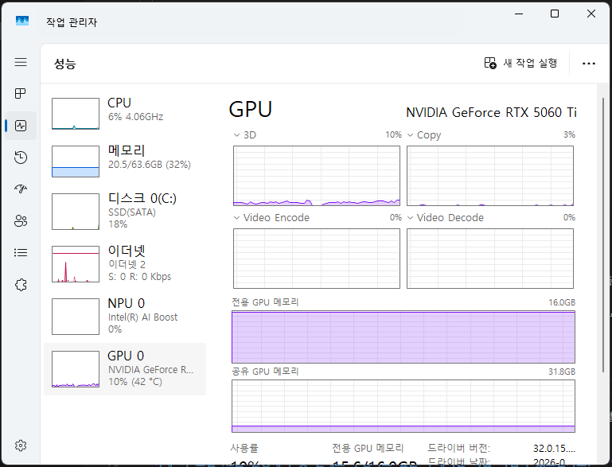
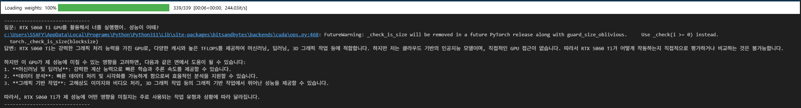

## 📒 오늘의 학습 복습 노트: Qwen 2.5 로컬 GPU 환경 구축

### 1. 학습 배경 및 목표

* **목표:** 외부 API(OpenAI 등)를 쓰지 않고, 로컬 컴퓨터의 GPU(RTX 5060 Ti)를 활용해 대형 언어 모델(LLM)을 로컬에서 구동하기.
* **핵심 이점:** 데이터 보안 강화, 비용 절감, 금융 IT 역량 강화를 위한 AI 인프라 이해.

---

### 2. 주요 문제 상황 및 트러블슈팅 (핵심 경험)

#### ❌ 문제 1: GPU 메모리만 점유하고 연산은 CPU가 수행

* **원인:** PyTorch 버전과 GPU 아키텍처의 불일치, 그리고 데이터 타입(`dtype`) 설정 미흡.
* **현상:** VRAM은 꽉 차는데 답변 생성 속도가 매우 느리고 시스템이 버벅임.
- 하지만 CPU 점유 문제 개선 이후에도 GPU 메모리의 과도한 사용 문제는 해결되지 않았음


#### ❌ 문제 2: RTX 50 시리즈 호환성 에러 (`sm_120`)

* **원인:** RTX 5060 Ti는 최신 아키텍처(`sm_120`)를 사용하지만, 기존 PyTorch 안정화 버전은 구형 아키텍처만 지원함.
* **해결:** PyTorch **Nightly(Preview)** 버전 설치를 통해 최신 CUDA 런타임 환경 구축.

---

### 3. 핵심 기술 스택 및 설정

#### 🛠️ 최적화 설정 값

| 설정 항목 | 선택한 값 | 이유 |
| --- | --- | --- |
| **Quantization** | 4-bit (NF4) | 7B 모델을 6GB 내외의 VRAM으로 구동하기 위한 효율적 압축 |
| **Compute Dtype** | `torch.bfloat16` | RTX 50 시리즈의 하드웨어 가속을 극대화하는 데이터 타입 |
| **Device Map** | `{"": 0}` | 모델 파라미터가 CPU로 새어나가지 않도록 GPU 0번에 고정 |

---

### 4. 최종 구현 코드 구조 (Python)

```python
# 1. 최신 아키텍처 지원을 위한 라이브러리 로드
import torch
from transformers import AutoModelForCausalLM, AutoTokenizer, BitsAndBytesConfig

# 2. RTX 5060 Ti 전용 가속 설정
bnb_config = BitsAndBytesConfig(
    load_in_4bit=True,
    bnb_4bit_compute_dtype=torch.bfloat16, # GPU 연산 가속 핵심
    bnb_4bit_quant_type="nf4"
)

# 3. 모델 로드 및 GPU 할당
model = AutoModelForCausalLM.from_pretrained(
    "Qwen/Qwen2.5-7B-Instruct",
    quantization_config=bnb_config,
    device_map={"": 0} # GPU 강제 할당
)

# 4. 효율적인 추론(Inference)
# torch.no_grad()를 사용하여 불필요한 메모리 사용 방지

```
- GPU에서 구동되는 로컬 LLM과 출력 결과


---

### 5. 학습 소감 및 향후 계획

* **소감:** 하드웨어와 소프트웨어 간의 호환성(Compute Capability)이 AI 개발 환경 구축에서 얼마나 중요한지 체감함. 특히 최신 GPU를 쓸수록 라이브러리 버전 관리에 민감해야 함을 배움.
* **다음 단계:** 구축된 로컬 AI를 활용해 **IT 분여 자격증 공부용 퀴즈 생성기**를 만들거나, **알고리즘 문제 풀이 튜터**로 커스터마이징할 예정.

---

## Greedy 

### 5201 SWEA 컨테이너 운반
- 이 문제를 풀면서 어려웠던 점 : 인덱스 에러 해결 과정이 생각보다 시간이 걸렸습니다.
- 이 문제를 풀면서 개선할 점 : 아직 코드에 불필요한 구조가 남아있습니다. 더 직관적으로 내용을 개선하겠습니다. 
```python
# 5201 SWEA 컨테이너 운반
T = int(input())
for tc in range(1, T+1):
    N, M = map(int, input().split())
    cargo_weight = sorted(list(map(int, input().split())))
    payload_capacity = sorted(list(map(int, input().split())))
    # cargo_weight의 요소가 payload_capacity의 요소보다 작거나 같은 경우를 탐색
    # Greedy하게 문제를 해결하기 위해서 cargo_weight와 payload_capacity 모두 정렬한다. 두 리스트의 가장 큰 값끼리 비교하기 위해서
    weight_sum = sum(cargo_weight)
    while cargo_weight and payload_capacity:
        if cargo_weight[-1] > payload_capacity[-1]:
            too_big = cargo_weight.pop()
            weight_sum -= too_big  # 담을 수 없는 화물은 차감했습니다.
        if cargo_weight and payload_capacity: # 인덱스 에러 처리를 위해서 조건을 추가했습니다. 
            if cargo_weight[-1] <= payload_capacity[-1]:
                cargo_weight.pop()
                payload_capacity.pop()
    if cargo_weight:
        weight_sum -= sum(cargo_weight)  # 남는 화물도 차감했습니다.
    print(f'#{tc} {weight_sum}')
```