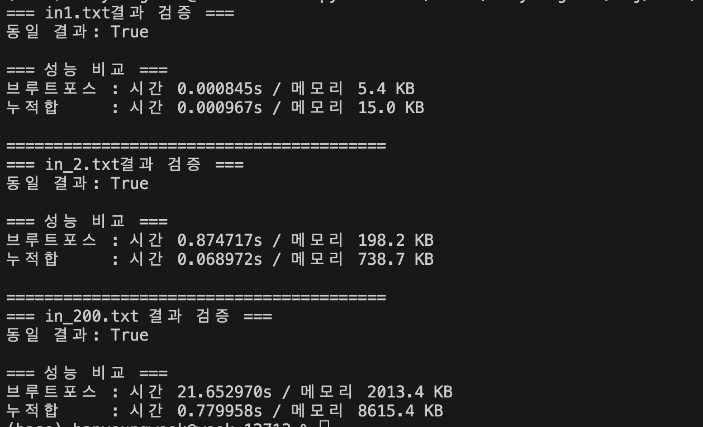

# list 2-2 정리본


## 파리퇴치 3


아래 코드를 이용해 두가지 방법으로 풀었습니다.

실험결과 
```python
import sys
import time
import tracemalloc
import os

def read_all_inputs(folder_path):
    files = sorted(
        f for f in os.listdir(folder_path)
        if f.endswith(".txt")
    )

    datasets = []
    for fname in files:
        with open(os.path.join(folder_path, fname), "r") as f:
            datasets.append((fname, f.read()))

    return datasets

# =========================
# 1. 브루트포스 풀이
# =========================
def solve_bruteforce(data: str):
    it = iter(data.split())
    T = int(next(it))
    results = []

    for _ in range(T):
        N, M = int(next(it)), int(next(it))
        A = [[int(next(it)) for _ in range(N)] for _ in range(N)]

        def in_range(x, y):
            return 0 <= x < N and 0 <= y < N

        ans = 0
        for i in range(N):
            for j in range(N):
                s1 = A[i][j]
                for k in range(1, M):
                    for dx, dy in [(k,0),(-k,0),(0,k),(0,-k)]:
                        ni, nj = i+dx, j+dy
                        if in_range(ni, nj):
                            s1 += A[ni][nj]

                s2 = A[i][j]
                for k in range(1, M):
                    for dx, dy in [(k,k),(-k,-k),(k,-k),(-k,k)]:
                        ni, nj = i+dx, j+dy
                        if in_range(ni, nj):
                            s2 += A[ni][nj]

                ans = max(ans, s1, s2)

        results.append(ans)

    return results


# =========================
# 2. 누적합 최적화 풀이
# =========================
def solve_prefix(data: str):
    it = iter(data.split())
    T = int(next(it))
    results = []

    for _ in range(T):
        N, M = int(next(it)), int(next(it))
        A = [[int(next(it)) for _ in range(N)] for _ in range(N)]
        R = M - 1

        row = [[0]*(N+1) for _ in range(N)]
        col = [[0]*N for _ in range(N+1)]

        for i in range(N):
            for j in range(N):
                row[i][j+1] = row[i][j] + A[i][j]
                col[i+1][j] = col[i][j] + A[i][j]

        diag1 = [[] for _ in range(2*N-1)]
        pos1 = [[0]*N for _ in range(N)]
        for d in range(-(N-1), N):
            idx = 0
            i = max(0, d)
            j = i - d
            did = d + (N-1)
            while 0 <= i < N and 0 <= j < N:
                pos1[i][j] = idx
                diag1[did].append(A[i][j])
                i += 1; j += 1; idx += 1

        pref1 = [[0] for _ in range(2*N-1)]
        for i in range(2*N-1):
            for v in diag1[i]:
                pref1[i].append(pref1[i][-1] + v)

        diag2 = [[] for _ in range(2*N-1)]
        pos2 = [[0]*N for _ in range(N)]
        for s in range(2*N-1):
            idx = 0
            i = max(0, s-(N-1))
            j = s - i
            while 0 <= i < N and 0 <= j < N:
                pos2[i][j] = idx
                diag2[s].append(A[i][j])
                i += 1; j -= 1; idx += 1

        pref2 = [[0] for _ in range(2*N-1)]
        for i in range(2*N-1):
            for v in diag2[i]:
                pref2[i].append(pref2[i][-1] + v)

        ans = 0
        for i in range(N):
            for j in range(N):
                l = max(0, j-R)
                r = min(N-1, j+R)
                u = max(0, i-R)
                d = min(N-1, i+R)

                plus = (row[i][r+1] - row[i][l]) + (col[d+1][j] - col[u][j]) - A[i][j]

                d1 = i - j + (N-1)
                p1 = pos1[i][j]
                lo = max(0, p1-R)
                hi = min(len(diag1[d1])-1, p1+R)
                x1 = pref1[d1][hi+1] - pref1[d1][lo]

                d2 = i + j
                p2 = pos2[i][j]
                lo = max(0, p2-R)
                hi = min(len(diag2[d2])-1, p2+R)
                x2 = pref2[d2][hi+1] - pref2[d2][lo]

                ans = max(ans, plus, x1 + x2 - A[i][j])

        results.append(ans)

    return results


# =========================
# 3. 벤치마크 함수
# =========================
def benchmark(func, data):
    tracemalloc.start()
    start = time.perf_counter()

    result = func(data)

    end = time.perf_counter()
    _, peak = tracemalloc.get_traced_memory()
    tracemalloc.stop()

    return result, end - start, peak / 1024  # KB


# =========================
# 4. main
# =========================
def main():
    with open("in1.txt", "r") as f:
        data = f.read()

    r1, t1, m1 = benchmark(solve_bruteforce, data)
    r2, t2, m2 = benchmark(solve_prefix, data)

    print("=== in1.txt결과 검증 ===")
    print("동일 결과:", r1 == r2)

    print("\n=== 성능 비교 ===")
    print(f"브루트포스 : 시간 {t1:.6f}s / 메모리 {m1:.1f} KB")
    print(f"누적합     : 시간 {t2:.6f}s / 메모리 {m2:.1f} KB")

    print("\n========================================")
    with open("in2.txt", "r") as f:
        data = f.read()

    r1, t1, m1 = benchmark(solve_bruteforce, data)
    r2, t2, m2 = benchmark(solve_prefix, data)

    print("=== in_2.txt결과 검증 ===")
    print("동일 결과:", r1 == r2)

    print("\n=== 성능 비교 ===")
    print(f"브루트포스 : 시간 {t1:.6f}s / 메모리 {m1:.1f} KB")
    print(f"누적합     : 시간 {t2:.6f}s / 메모리 {m2:.1f} KB")


    print("\n========================================")
    with open("in_200.txt", "r") as f:
        data = f.read()

    r1, t1, m1 = benchmark(solve_bruteforce, data)
    r2, t2, m2 = benchmark(solve_prefix, data)

    print(f'=== in_200.txt 결과 검증 ===')
    print("동일 결과:", r1 == r2)

    print("\n=== 성능 비교 ===")
    print(f"브루트포스 : 시간 {t1:.6f}s / 메모리 {m1:.1f} KB")
    print(f"누적합     : 시간 {t2:.6f}s / 메모리 {m2:.1f} KB")


if __name__ == "__main__":
    main()

```

이렇게 뜹니다.

작은 경우

60*60 경우

200*200 경우

순서 입니다. 



이를 통해 누적합을 이용해 풀이하는 것이 큰 수의 범위에서는 이득이라는 걸 알 수 있습니다.


##  정렬 정리!! 
다양한 정렬이 있고, 삽입 정렬도 존재합니다.
```python 
T = int(input())
for test_num in range(1,T+1):
    num = int (input())
    L = list(map(int,input().split()))
    sorted_list = sorted(L)
    print(f'#{test_num}',*sorted_list)


def bubbleSort(L:list):
    if len(L) == 1:
        return L
    else:
        length = len(L)
        for i in range(length-1):
            if L[i] > L[i+1]: #큰게 뒤로 가게 정렬
                L[i],L[i+1] = L[i+1],L[i]
        return bubbleSort(L[:-1]) + [L[-1]]

T = int(input())
for test_num in range(1,T+1):
    num = int (input())
    L = list(map(int,input().split()))
    sorted_list = bubbleSort(L)

    print(f'#{test_num}',*sorted_list)


def selection_sort(L):
    find_min = 0 #최소값 인덱스
    Length = len(L)
    for p in range(Length):
        find_min = p
        for i in range(p,Length):
            if L[i] < L[find_min]:
                find_min = i
        L[p] , L[find_min] = L[find_min],L[p]

T = int(input())
for test_num in range(1,T+1):
    num = int (input())
    L = list(map(int,input().split()))
    sorted_list = sorted(L)

    print(f'#{test_num}',*sorted_list)


    
def quick_sort(L):
    if len(L) ==1 or len(L) == 0:
        return L
    else:
        return quick_sort( [x for x in L if x < L[0]]) + [L[0]]  +quick_sort([x for x in L if x >= L[0]])


T = int(input())
for test_num in range(1,T+1):
    num = int (input())
    L = list(map(int,input().split()))
    sorted_list = sorted(L)

    print(f'#{test_num}',*sorted_list)
```


이상 금일 인상적인 부분에 대한 해설이었습니다.